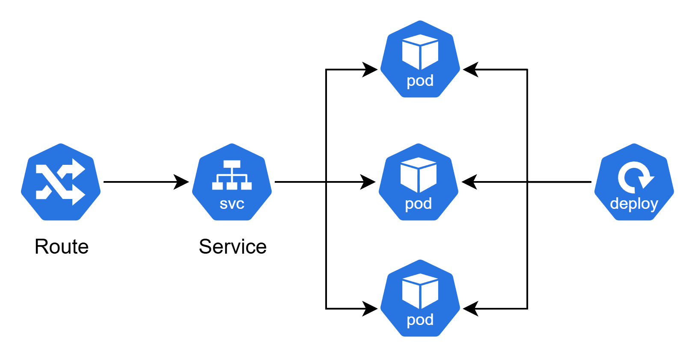

# Passo 2: Esplorazione dell'ambiente (Web + CLI)

## 🎯 Obiettivi di questo passo

- Familiarizzare con l'interfaccia web di OpenShift
- Comprendere gli oggetti Kubernetes/OpenShift principali
- Configurare e utilizzare la CLI `oc`

---

## Web GUI

### Panoramica dell'interfaccia OpenShift

**Concetti chiave da esplorare:**
- _Panoramica GUI OpenShift e come muoversi_
- _Panoramica sugli oggetti che verranno utilizzati_

### Oggetti Kubernetes/OpenShift che utilizzeremo

Durante il workshop lavoreremo con questi oggetti:

- **`Pod`** - Unità base di deployment, contenente uno o più container
- **`Deployment`** - Gestisce la creazione e l'aggiornamento dei Pod
- **`ReplicaSet`** - Mantiene il numero desiderato di repliche di un Pod
- **`Service`** - Espone i Pod come servizio di rete
- **`Route`** - Espone i servizi all'esterno del cluster (specifica OpenShift)
- **`ConfigMap`** - Memorizza dati di configurazione non sensibili
- **`Secret`** - Memorizza informazioni sensibili (password, token, ecc.)
- **`PersistentVolume(Claim)`** - Gestisce lo storage persistente


---

## oc CLI

### Effettuare login su terminale

1. Nella web GUI di OpenShift, fare click su menu proprio user in alto a destra
2. Selezionare "Copy login command" → SSO (AAD) → Display token → Copia in clipboard (ctrl+c) il comando `oc login --token=...` che compare nella pagina
3. Esegui il comando di login sul proprio terminale VS Code aperto prima
4. Confermare con `y` alla domanda "Use insecure connections?"
5. Esegui la selezione del progetto digitando `oc project ws-<username>`

### Sintassi dei comandi della CLI

**Esempi di comandi base:**

```bash
# Visualizzare il progetto corrente
oc project

# Cambiare progetto/namespace
oc project nome-progetto

# Ottenere informazioni su risorse
oc get pods
oc get services
oc get routes

# Applicare configurazioni da file
oc apply -f file.yaml

# Creare risorse da file
oc create -f file.yaml

# Descrivere una risorsa in dettaglio
oc describe pod nome-pod
```

---

## 💡 Tips e Best Practices

- **Web GUI**: Ottima per visualizzazione e monitoraggio
- **CLI**: Più efficiente per operazioni ripetitive e automazione
- **YAML files**: Modalità più indicata per definire risorse in modo dichiarativo

---

## ✅ Checkpoint

Prima di procedere al passo successivo, verifica che:

- [ ] Hai fatto login tramite `oc login` con successo
- [ ] Conosci la differenza tra Pod, Deployment e Service
- [ ] Sai navigare nell'interfaccia web di OpenShift

---

## 🚀 Prossimo passo

**Continua con:** [Passo 3: Primi passi →](./passo-3-primi-passi.md)

## 🔙 Navigazione

- [← Passo 1: Configurazione](./passo-1-configurazione.md)
- [← Indice Workshop](./README.md)
- [Passo 3: Primi passi →](./passo-3-primi-passi.md)