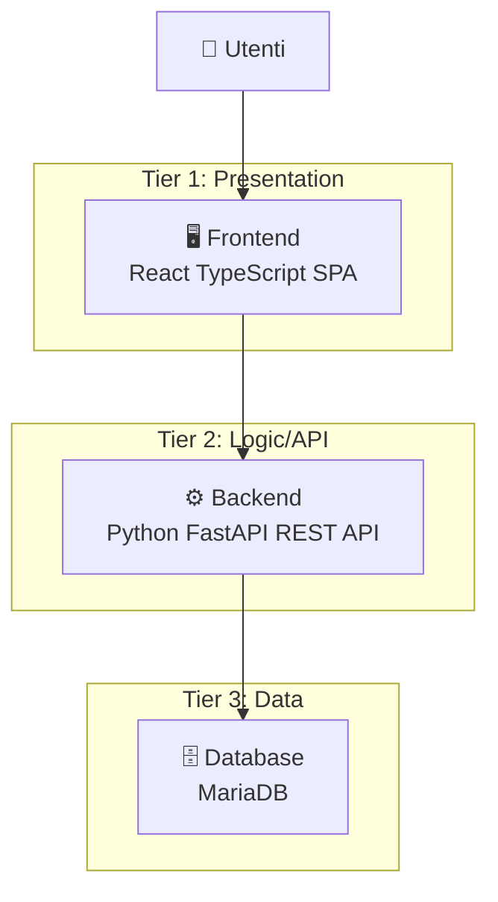

# Passo 4: L'applicazione oggetto del workshop

## 🎯 Obiettivi di questo passo

- Comprendere l'architettura dell'applicazione 3-tier
- Esplorare i componenti del sistema
- Preparare il deployment dei vari layer

---

## 🏗️ Architettura dell'Applicazione

L'applicazione che deployeremo è una classica architettura a **3 livelli (3-tier)**:



### Componenti del sistema:

#### 🖥️ **Frontend** - React TypeScript SPA
- **Tecnologia**: React con TypeScript
- **Funzionalità**: 
  - Interfaccia web per gestione ordini
  - Comunicazione con backend via REST API
  - Responsive design

#### ⚙️ **Backend** - Python FastAPI REST API  
- **Tecnologia**: FastAPI (Python)
- **Funzionalità**:
  - API REST per CRUD operazioni sugli ordini
  - Connessione al database
  - Documentazione automatica (Swagger/OpenAPI)
  - Metriche per osservabilità

#### 🗄️ **Database** - MariaDB
- **Tecnologia**: MariaDB (MySQL-compatible)
- **Funzionalità**:
  - Storage persistente degli ordini
  - Transazioni ACID
  - Backup e recovery

---

## 📂 Struttura dei file nel repository

Esploriamo la struttura del progetto:

```
workshop/
├── frontend/           # React TypeScript app
│   ├── src/
│   ├── public/
│   ├── Dockerfile
│   └── package.json
├── backend/            # FastAPI Python app  
│   ├── app/
│   ├── main.py
│   ├── Dockerfile
│   └── requirements.txt
├── openshift/          # Manifesti Kubernetes/OpenShift
│   ├── test-pod.yaml
│   ├── test-deployment.yaml
│   ├── local-db.yaml
│   ├── backend-deployment.yaml
│   ├── backend-network.yaml
│   └── frontend-deployment.yaml
└── db-init/           # Script inizializzazione DB
    └── 01-init-orders.sql
```

---

## 🔄 Flusso di deployment

Nei prossimi passi deployeremo i componenti in questo ordine:

1. **Database** (Passo 5) - Layer di persistenza
2. **Backend** (Passo 6) - API layer che si connette al DB
3. **Frontend** (Passo 7) - UI layer che comunica con le API

### Perché questo ordine?

- **Dipendenze**: Il backend dipende dal database, il frontend dal backend
- **Testing**: Possiamo testare ogni layer incrementalmente
- **Debugging**: Più facile identificare problemi layer per layer

---

## 💡 Evoluzione del sistema

Durante il workshop:

1. **Inizialmente**: Database locale (MariaDB in container)
2. **Successivamente**: Switch verso database centralizzato MSSQL già deployato

Questo ci permetterà di vedere:
- **Configurazione dinamica** dei servizi
- **Migration** dei dati
- **Service discovery** in OpenShift

---

## ✅ Checkpoint

Prima di procedere al passo successivo, verifica di aver compreso:

- [ ] L'architettura 3-tier dell'applicazione
- [ ] Il ruolo di ogni componente (Frontend, Backend, Database)
- [ ] La struttura dei file nel repository
- [ ] L'ordine di deployment e le dipendenze

---

## 🚀 Prossimo passo

**Continua con:** [Passo 5: Deployment del Database →](./passo-5-database.md)

## 🔙 Navigazione

- [← Passo 3: Primi passi](./passo-3-primi-passi.md)
- [← Indice Workshop](./README.md)
- [Passo 5: Deployment del Database →](./passo-5-database.md)