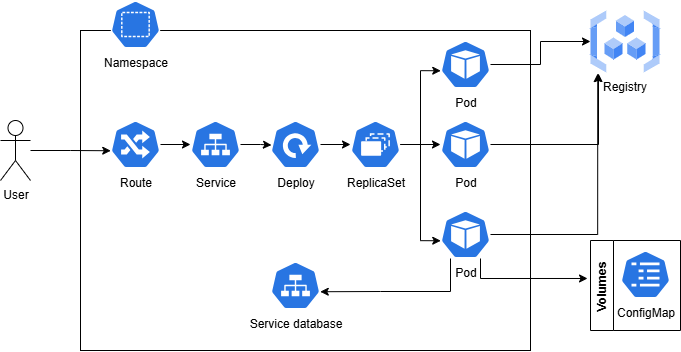

# Passo 6: Deployment dell'API Backend

## 🎯 Obiettivi di questo passo

- Buildare l'immagine Docker del backend
- Deployare l'API FastAPI
- Configurare la comunicazione con il database
- Esporre il servizio all'esterno tramite Route
- Testare le API REST

---

Procediamo creando lo strato di backend dell'applicazione. Questo container sa collegarsi al DB ed espone i propri servizi tramite REST API.

## 🐳 Build dell'immagine Docker

> Analizzare la struttura del file `./backend/Dockerfile`

### 1. Build dell'immagine del backend

```bash
docker build .\backend\ -t postesviluppo.azurecr.io/cangem/workshop-backend
```

**Nota importante:** L'immagine deve essere pushata su un registry accessibile da OpenShift.

### 2. Push dell'immagine (se necessario)

**QUESTO PASSO SOLO PER L'ISTRUTTORE**

```bash
# Login al registry (se richiesto)
docker login postesviluppo.azurecr.io

# Push dell'immagine
docker push postesviluppo.azurecr.io/cangem/workshop-backend
```

---

## 🚀 Deploy del Backend

> Analizzare il file `./openshift/backend-deployment.yaml`
> Fare attenzione al campo `spec.containers[].image`

### 3. Creare il deployment del backend

```bash
oc create -f ./openshift/backend-deployment.yaml
```

**Oggetti creati:**
- **Deployment**: Gestisce i pod del backend
- **ConfigMap**: Contiene configurazioni dell'applicazione (URL database, parametri, ecc.)

### 4. Verificare gli oggetti creati

```bash

# Focus su deployment e configmap
oc get deployment,configmap

# Dettagli del deployment
oc describe deployment workshop-backend
```

> **Il parametro database-connection-string dovrebbe puntare al nostro db locale tramite service:porta (mariadb:3306), ma ATTENZIONE...**

---

## 🌐 Configurazione di rete

### 5. Creare gli oggetti di rete

> Analizzare il file `./openshift/backend-network.yaml`

```bash
oc create -f ./openshift/backend-network.yaml
```

**Oggetti creati:**
- **Service**: Endpoint interno per comunicazione inter-pod
- **Route**: Endpoint esterno per accesso dall'esterno del cluster

### 6. Verificare gli oggetti di rete

```bash
# Visualizzare servizi e route
oc get service,route

# Dettagli della route
oc describe route workshop-backend
```

> Osservare la URL della rotta


---

## 🧪 Testing delle API

### 7. Visualizzare la documentazione Swagger

Le API FastAPI generano automaticamente una documentazione interattiva:

1. Aprire il browser sull'URL: `https://workshop-backend-<tuo-namespace>.apps.ocp4azexp2.cloudsvil.poste.it/docs`
2. Esplorare le API disponibili
3. Testare alcune chiamate direttamente dal browser

### 8. Test tramite cURL

```bash
# Ottenere lista degli ordini
curl.exe 'https://workshop-backend-<tuo-namespace>.apps.ocp4azexp2.cloudsvil.poste.it/api/v1/orders/'
```

> **Importante su Windows:** Usare `curl.exe` non semplicemente `curl`

**ERRORE: Interla Server Error**
---

### 9. **Correzione e Rollout:** Effettuare un aggiornamento del deployment a caldo:
1. Analizziamo quale sia il problema:
```bash
oc logs deployment/workshop-backend
```

Errore:  
```
"Can't connect to MySQL server on '<nome-service-db>' ([Errno -2] Name or service not known)"
```

2. Correggiamo la config map da Web GUI andando in Workload -> ConfigMaps -> `workshop-backend-config` -> Actions (pulsante in alto a destra) -> "Edit ConfigMap"
3. Salvare con "Save"
4. riavviamo il Deployment con:

```bash
oc rollout restart deployment workshop-backend

# Visualizzare lo stato dei pod/ReplicaSet anche nella Web GUI (Deployment)
oc get pods -l app=httpd
```

5. Testiamo di nuovo:

```bash
# Ottenere lista degli ordini
curl.exe 'https://workshop-backend-<tuo-namespace>.apps.ocp4azexp2.cloudsvil.poste.it/api/v1/orders/'
```

## 📈 Scaling e Load Balancing

### 10. Testare lo scaling del backend

```bash
# Scalare a 3 repliche
oc scale deployment workshop-backend --replicas=3

# Verificare che i pod siano stati creati (notare l'appartenenza a nodi diversi)
oc get pod -l app=workshop-backend -owide

# Verificare distribuzione del carico
# Esegui la curl 5 volte (o più)
curl.exe 'https://workshop-backend-<tuo-namespace>.apps.ocp4azexp2.cloudsvil.poste.it/api/v1/orders/'

# Verifica dai log dei pod che l'operazione sia stata invocata su diversi pod
oc logs -l app=workshop-backend -f # in alternativa visualizzare i log da Web
```

**Cosa osservare:**
- I pod vengono distribuiti su nodi diversi (se disponibili)
- Le richieste vengono bilanciate tra le repliche
- Il Service fa da load balancer interno

---

### Health checks

```bash
# Verificare endpoint di health
curl.exe 'https://workshop-backend-<namespace>.apps.ocp4azexp2.cloudsvil.poste.it/health'

```
> Questo è il meccanismo che usa la kubelet per verificare se il container è healthy e/o ready

---

## ✅ Checkpoint

Prima di procedere al passo successivo, verifica che:

- [ ] Il deployment del backend sia in stato `Available`
- [ ] Ci siano 3 repliche in esecuzione
- [ ] La Route sia raggiungibile dall'esterno
- [ ] Le API REST rispondano correttamente
- [ ] La documentazione Swagger sia accessibile

**Comandi di verifica rapida:**
```bash
oc get deployment workshop-backend
oc get pods -l app=workshop-backend
oc get route workshop-backend
curl.exe 'https://workshop-backend-<namespace>.apps.ocp4azexp2.cloudsvil.poste.it/health'
```

---

## 🚀 Prossimo passo

**Continua con:** [Passo 7: Deployment del Frontend →](./passo-7-frontend.md)

## 🔙 Navigazione

- [← Passo 5: Deployment del Database](./passo-5-database.md)
- [← Indice Workshop](./README.md)
- [Passo 7: Deployment del Frontend →](./passo-7-frontend.md)