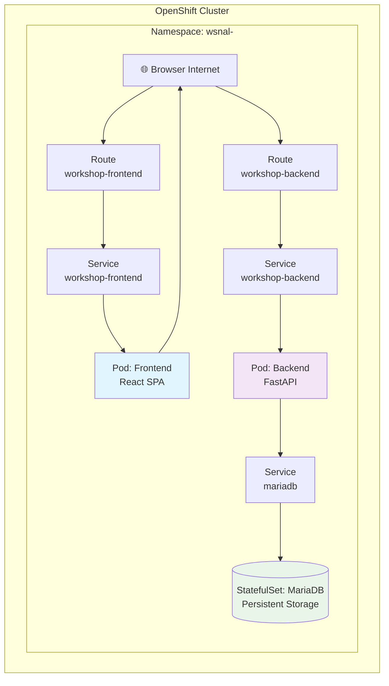

# Passo 7: Deployment del Frontend

## 🎯 Obiettivi di questo passo

- Deployare la Single Page Application (SPA) React
- Configurare il frontend per comunicare con il backend
- Testare l'applicazione completa end-to-end
- Verificare il funzionamento dell'intero stack 3-tier

---

Completiamo lo stack aggiungendo l'ultimo layer: il frontend React TypeScript.

## 🚀 Deploy del Frontend

### 1. Creare il deployment del frontend

- Aprire su VS Code il file `./openshift/frontend-deployment.yaml`
- Analizzare la struttura ed intercettare la `ConfigMap`
- Modificare il valore dell'attributo `api-url` sostituendo il nome del proprio namespace all'interno della url della rotta

```bash
oc create -f ./openshift/frontend-deployment.yaml
```

**Oggetti creati:**
- **Deployment**: Gestisce i pod del frontend
- **Service**: Endpoint interno per il frontend
- **Route**: Endpoint esterno per l'accesso web
- **ConfigMap**: Configurazioni specifiche del frontend (URL backend, ecc.)

### 2. Monitorare il processo di deployment

```bash
# Osservare la creazione dei pod
oc get pods -w -l app=workshop-frontend

# Verificare lo stato del deployment
oc get deployment workshop-frontend
```

---

## 🌐 Accesso all'applicazione web

### 3. Ottenere l'URL dell'applicazione

```bash
oc get route workshop-frontend -o jsonpath='{.spec.host}'
```

**Output esempio:**
```
workshop-frontend-ws-user01.apps.ocp4azexp2.cloudsvil.poste.it
```

### 4. Accedere all'applicazione

1. Copiare l'URL ottenuto dal comando precedente
2. Aprire il browser e navigare all'indirizzo
3. L'applicazione dovrebbe caricarsi mostrando l'interfaccia per la gestione ordini

---

## 🧪 Test dell'applicazione completa

### 5. Testing funzionale end-to-end

Ora possiamo testare l'intera catena applicativa:

**Frontend → Backend → Database → Backend → Frontend**

#### Operazioni CRUD da testare:

1. **CREATE**: Creare un nuovo ordine
   - Cliccare "Create New Order"
   - Compilare il form inserendo "Order details"
   - Verificare che appaia nella lista

2. **UPDATE**: Modificare un ordine esistente
   - Cliccare su "Modifica" per un ordine
   - Cambiare il valore di Order details
   - Salvare e verificare le modifiche

3. **DELETE**: Eliminare un ordine
   - Cliccare su "Elimina" per un ordine
   - Confermare l'eliminazione
   - Verificare che non appaia più nella lista

---

## 📊 Architettura completa deployata

A questo punto dovresti avere un'architettura completa:



---

## ✅ Checkpoint

Prima di procedere al passo successivo, verifica che:

- [ ] Il deployment del frontend sia in stato `Available`
- [ ] La Route del frontend sia raggiungibile
- [ ] L'applicazione web si carichi correttamente
- [ ] Puoi creare, visualizzare, modificare ed eliminare ordini
- [ ] I dati persistono dopo il refresh della pagina

**Test completo:**
1. Apri l'applicazione web nel browser
2. Crea un nuovo ordine con dati di test
3. Ricarica la pagina - l'ordine deve essere ancora visibile
4. Modifica l'ordine creato
5. Elimina l'ordine

---

## 🚀 Prossimo passo

**Continua con:** [Passo 8: Osservabilità →](./passo-8-osservabilita.md)

## 🔙 Navigazione

- [← Passo 6: Deployment dell'API Backend](./passo-6-backend.md)
- [← Indice Workshop](./README.md)
- [Passo 8: Osservabilità →](./passo-8-osservabilita.md)