# Passo 7: Deployment del Frontend

## 🎯 Obiettivi di questo passo

- Deployare la Single Page Application (SPA) React
- Configurare il frontend per comunicare con il backend
- Testare l'applicazione completa end-to-end
- Verificare il funzionamento dell'intero stack 3-tier

---

Completiamo lo stack aggiungendo l'ultimo layer: il frontend React TypeScript.

## 🚀 Deploy del Frontend

### 1. Creare il deployment del frontend

```bash
oc create -f ./openshift/frontend-deployment.yaml
```

**Oggetti creati:**
- **Deployment**: Gestisce i pod del frontend
- **Service**: Endpoint interno per il frontend
- **Route**: Endpoint esterno per l'accesso web
- **ConfigMap**: Configurazioni specifiche del frontend (URL backend, ecc.)

### 2. Monitorare il processo di deployment

```bash
# Osservare la creazione dei pod
oc get pods -w -l app=workshop-frontend

# Verificare lo stato del deployment
oc get deployment workshop-frontend
```

---

## 🌐 Accesso all'applicazione web

### 3. Ottenere l'URL dell'applicazione

```bash
oc get route workshop-frontend -o jsonpath='{.spec.host}'
```

**Output esempio:**
```
workshop-frontend-wsnal-user01.apps.ocp4azexp2.cloudsvil.poste.it
```

### 4. Accedere all'applicazione

1. Copiare l'URL ottenuto dal comando precedente
2. Aprire il browser e navigare all'indirizzo
3. L'applicazione dovrebbe caricarsi mostrando l'interfaccia per la gestione ordini

---

## 🧪 Test dell'applicazione completa

### 5. Testing funzionale end-to-end

Ora possiamo testare l'intera catena applicativa:

**Frontend → Backend → Database → Backend → Frontend**

#### Operazioni CRUD da testare:

1. **CREATE**: Creare un nuovo ordine
   - Compilare il form con: Nome cliente, Prodotto, Quantità
   - Cliccare "Crea Ordine"
   - Verificare che appaia nella lista

2. **READ**: Visualizzare gli ordini esistenti
   - La homepage dovrebbe mostrare tutti gli ordini
   - Includendo quelli inseriti durante l'inizializzazione del DB

3. **UPDATE**: Modificare un ordine esistente
   - Cliccare su "Modifica" per un ordine
   - Cambiare alcuni valori
   - Salvare e verificare le modifiche

4. **DELETE**: Eliminare un ordine
   - Cliccare su "Elimina" per un ordine
   - Confermare l'eliminazione
   - Verificare che non appaia più nella lista

---

## 🔍 Monitoraggio dell'applicazione

### 6. Osservare il traffico tra i servizi

```bash
# Log del frontend
oc logs -l app=workshop-frontend

# Log del backend (mostrare richieste API)
oc logs -l app=workshop-backend

# Log del database (se necessario)
oc logs -l app=mariadb
```

### 7. Verificare la comunicazione inter-service

```bash
# Test connettività frontend -> backend
oc exec -it <pod-frontend> -- curl http://workshop-backend:8000/health

# Test connettività backend -> database  
oc exec -it <pod-backend> -- mysql -h mariadb -u root -p -e "SELECT COUNT(*) FROM orders_db.orders;"
```

---

## 📊 Architettura completa deployata

A questo punto dovresti avere un'architettura completa:

```mermaid
graph TB
    subgraph "OpenShift Cluster"
        subgraph "Namespace: wsnal-<user>"
            Internet[🌐 Internet] --> Route1[Route<br/>workshop-frontend]
            Route1 --> Service1[Service<br/>workshop-frontend]
            Service1 --> Frontend[Pod: Frontend<br/>React SPA]
            
            Frontend --> Service2[Service<br/>workshop-backend]
            Service2 --> Backend[Pod: Backend<br/>FastAPI]
            
            Backend --> Service3[Service<br/>mariadb]
            Service3 --> Database[(StatefulSet: MariaDB<br/>Persistent Storage)]
        end
    end
    
    classDef frontend fill:#e1f5fe
    classDef backend fill:#f3e5f5  
    classDef database fill:#e8f5e8
    
    class Frontend frontend
    class Backend backend
    class Database database
```



---

## 🛠️ Troubleshooting comune

### Frontend non carica

**Possibili cause:**
- Route non configurata correttamente
- Pod frontend non in running
- Errori di build del container

**Debug:**
```bash
oc describe route workshop-frontend
oc logs <pod-frontend>
oc describe pod <pod-frontend>
```

### Frontend carica ma non mostra dati

**Possibili cause:**
- Backend non raggiungibile dal frontend
- Configurazione URL backend errata
- Problemi CORS

**Debug:**
```bash
# Verificare configurazione frontend
oc describe configmap workshop-frontend-config

# Testare connettività interna
oc exec -it <pod-frontend> -- curl http://workshop-backend:8000/api/v1/orders/
```

### Errori nelle operazioni CRUD

**Possibili cause:**
- Database non accessibile
- Errori nella logica backend
- Problemi di permessi

**Debug:**
```bash
# Log dettagliati backend
oc logs <pod-backend> -f

# Connessione diretta al database
oc exec -it <pod-mariadb> -- mysql -u root -p
```

---

## ✅ Checkpoint

Prima di procedere al passo successivo, verifica che:

- [ ] Il deployment del frontend sia in stato `Available`
- [ ] La Route del frontend sia raggiungibile
- [ ] L'applicazione web si carichi correttamente
- [ ] Puoi creare, visualizzare, modificare ed eliminare ordini
- [ ] I dati persistono dopo il refresh della pagina

**Test completo:**
1. Apri l'applicazione web nel browser
2. Crea un nuovo ordine con dati di test
3. Ricarica la pagina - l'ordine deve essere ancora visibile
4. Modifica l'ordine creato
5. Elimina l'ordine

---

## 🚀 Prossimo passo

**Continua con:** [Passo 8: Osservabilità →](./passo-8-osservabilita.md)

## 🔙 Navigazione

- [← Passo 6: Deployment dell'API Backend](./passo-6-backend.md)
- [← Indice Workshop](./README.md)
- [Passo 8: Osservabilità →](./passo-8-osservabilita.md)