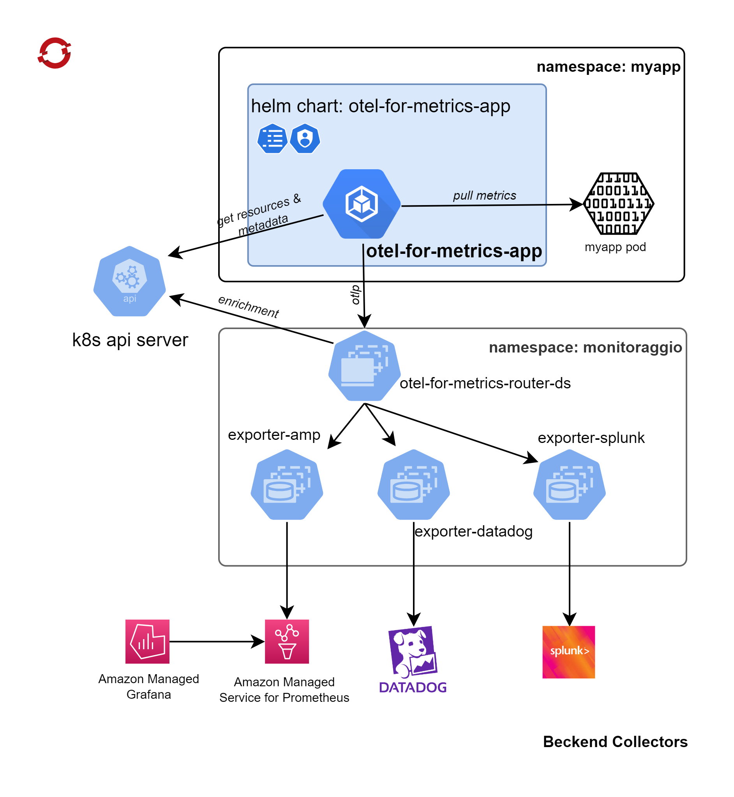

# Passo 8: Osservabilità

## 🎯 Obiettivi di questo passo

- Comprendere l'importanza dell'osservabilità nei microservizi
- Configurare la raccolta di metriche applicative
- Installare un collettore di metriche OpenTelemetry
- Visualizzare metriche custom dell'applicazione

---

In questa sezione installeremo un collettore che si occupa di raccogliere le metriche applicative esposte dal backend.

## 📊 Visualizzazione delle metriche esistenti

### 1. Esplorare le metriche esposte dal backend

Il backend FastAPI espone automaticamente metriche in formato Prometheus:

```bash
# Ottenere l'URL del backend
oc get route workshop-backend -o jsonpath='{.spec.host}'
```

1. Aprire il browser all'URL: `https://workshop-backend-<namespace>.apps.ocp4azexp2.cloudsvil.poste.it/metrics`

2. **Analizzare le metriche disponibili:**
   - Metriche HTTP (richieste, latenza, codici di stato)
   - Metriche custom dell'applicazione (ordini creati, eliminati, ecc.)
   - Metriche di sistema (memoria, CPU)

### 2. Comprendere il formato Prometheus

```
# HELP orders_created_total Total number of orders created
# TYPE orders_created_total counter
orders_created_total 15

# HELP http_requests_total Total HTTP requests
# TYPE http_requests_total counter  
http_requests_total{method="GET",endpoint="/api/v1/orders"} 42

# HELP http_request_duration_seconds HTTP request duration
# TYPE http_request_duration_seconds histogram
http_request_duration_seconds_bucket{le="0.1"} 20
```

### 3. Verificare le annotation del deployment

```bash
oc get deployment workshop-backend -oyaml | grep -A5 -B5 annotation
```

**Annotation importanti per il discovery:**
```yaml
annotations:
  prometheus.io/scrape: "true"
  prometheus.io/port: "8000"  
  prometheus.io/path: "/metrics"
```

---

## 🔧 Setup del collettore di metriche

### 4. Comprendere Helm Charts

**Cos'è un Helm Chart?**

Un Helm Chart è un pacchetto di template Kubernetes che permette di:
- **Parametrizzare** configurazioni tramite values
- **Riutilizzare** deployment patterns
- **Versionare** release applicative
- **Gestire** dipendenze tra componenti

**Struttura tipica:**
```
chart/
├── Chart.yaml          # Metadata del chart
├── values.yaml          # Valori di default
├── templates/          # Template Kubernetes
│   ├── deployment.yaml
│   ├── service.yaml
│   └── configmap.yaml
└── charts/             # Dipendenze
```

---

## ⚙️ Configurazione e installazione di OTEL for metrics App

## 📊 Comprensione dell'architettura osservabilità



**Flusso dei dati:**
1. **App pods** espongono metriche su endpoint `/metrics`
2. **OTEL for metrics app** fa scraping di metriche tramite service discovery e reinoltra
3. **Exporter** invia a sistemi centrali di raccolta metriche
4. **Collectors** aggrega, memorizza e visualizza

### 5. Personalizzare la configurazione

1. Aprire il file `./otel/values.yaml`
2. Trovare la sezione `regex_metric_relabel_configs`
3. Modificare per catturare solo le metriche degli ordini:

```yaml
regex_metric_relabel_configs: "orders.*"
```

**Cosa fa questa configurazione:**
- Filtra solo le metriche che iniziano con "orders"
- Riduce il carico sui sistemi di monitoring
- Focus su metriche business-relevant

### 6. Installare il collettore nel proprio namespace

```bash
helm install otel .\otel\otel-for-metrics-app-1.1.0.tgz -n <mio_namespace> -f .\otel\values.yaml
```

**Cosa viene installato:**
- **OpenTelemetry Collector**: Raccoglie metriche da pod annotati
- **ConfigMap**: Configurazione del collettore
- **Service**: Endpoint per raccolta metriche
- **ServiceAccount**: Permessi per service discovery

### 7. Verificare l'installazione

```bash
# Verificare i pod del collettore
oc get pods -l app.kubernetes.io/name=otel-for-metrics-app
```

---

## 📈 Test della raccolta metriche

### 8. Generare operazioni applicative

Per vedere metriche significative, generiamo attività nell'app creando nuovi ordini, direttamente dall'interfaccia web dell'applicazione stessa.

---

## 🎯 Dashboard e Visualizzazione

### 9. Visualizzazione dashboard (**solo istruttore**)

L'istruttore mostrerà:
- **Dashboard Grafana** con metriche aggregate
- **Query PromQL** per analisi dati

---

## 💡 Best Practices osservabilità

### Metriche applicative importanti

- **Business metrics**: Ordini creati, fatturato, conversioni
- **Technical metrics**: Latenza, throughput, error rate  
- **Infrastructure metrics**: CPU, memoria, storage

### Livelli di osservabilità

1. **Logs**: Eventi dettagliati per debugging
2. **Metrics**: Valori numerici aggregabili nel tempo
3. **Traces**: Percorso richieste attraverso i servizi

---

## ✅ Checkpoint

Prima di procedere al passo successivo, verifica che:

- [ ] Puoi accedere all'endpoint `/metrics` del backend
- [ ] Il collettore OpenTelemetry sia installato e running
- [ ] I log del collettore mostrino raccolta di metriche
- [ ] Hai generato traffico applicativo per test
- [ ] Comprendi l'architettura di osservabilità

**Verifica tecnica:**
```bash
oc get pods -l app.kubernetes.io/name=otel
oc logs -l app.kubernetes.io/name=otel --tail=20
curl.exe 'https://workshop-backend-<namespace>.apps.ocp4azexp2.cloudsvil.poste.it/metrics' | grep orders
```

---

## 🚀 Prossimo passo

**Continua con:** [Passo 9: Collegare il database centralizzato →](./passo-9-database-switch.md)

## 🔙 Navigazione

- [← Passo 7: Deployment del Frontend](./passo-7-frontend.md)
- [← Indice Workshop](./README.md)
- [Passo 9: Collegare il database →](./passo-9-database-switch.md)
