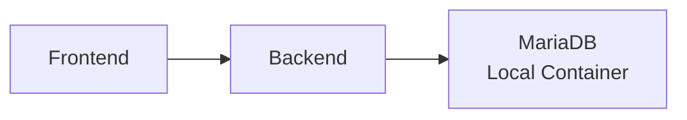
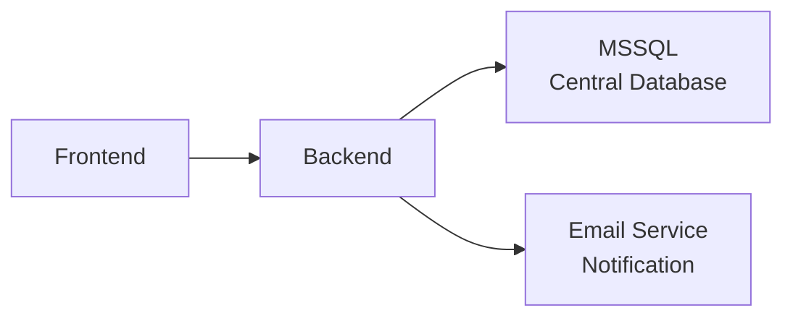

# Passo 9: Collegare il database

## 🎯 Obiettivi di questo passo

- Switchare il backend dal database locale a quello centralizzato
- Comprendere la gestione delle configurazioni in OpenShift
- Testare la migrazione dei dati
- Sperimentare con notifiche email

---

In questo passo finale migreremo l'applicazione dal database MariaDB locale ad un database MSSQL centralizzato già deployato nell'infrastruttura.

## 🔄 Panoramica della migrazione

### Architettura attuale vs target

**PRIMA (Architettura attuale):**


**DOPO (Architettura target):**


### Vantaggi del database centralizzato

- **Scalabilità**: Gestito da team DBA specializzati
- **Backup/Recovery**: Strategie enterprise-grade
- **Sicurezza**: Controlli di accesso centralizzati
- **Performance**: Hardware dedicato e ottimizzato
- **Compliance**: Audit trail e governance

---

## 🔧 Configurazione del nuovo database

### 1. Preparazione credenziali (**solo istruttore**)

L'istruttore configurerà:

```bash
# Creazione del Secret per le credenziali MSSQL
oc create secret generic mssql-credentials \
  --from-literal=host="mssql-server.database.svc.cluster.local" \
  --from-literal=port="1433" \
  --from-literal=username="workshop_user" \
  --from-literal=password="SecurePassword123!" \
  --from-literal=database="WorkshopDB"

# Verifica della creazione
oc describe secret mssql-credentials
```

### 2. Aggiornamento ConfigMap backend

```bash
# Backup della configurazione attuale
oc get configmap workshop-backend-config -o yaml > backup-config.yaml

# Update della configurazione per puntare al nuovo DB
oc patch configmap workshop-backend-config --type merge -p '{
  "data": {
    "DATABASE_TYPE": "mssql",
    "DATABASE_HOST": "mssql-server.database.svc.cluster.local",
    "DATABASE_PORT": "1433",
    "DATABASE_NAME": "WorkshopDB"
  }
}'
```

### 3. Modifica del Deployment per usare il Secret

```bash
# Update del deployment per montare le credenziali
oc patch deployment workshop-backend --type merge -p '{
  "spec": {
    "template": {
      "spec": {
        "containers": [{
          "name": "backend",
          "env": [
            {
              "name": "DATABASE_USER",
              "valueFrom": {
                "secretKeyRef": {
                  "name": "mssql-credentials",
                  "key": "username"
                }
              }
            },
            {
              "name": "DATABASE_PASSWORD", 
              "valueFrom": {
                "secretKeyRef": {
                  "name": "mssql-credentials",
                  "key": "password"
                }
              }
            }
          ]
        }]
      }
    }
  }
}'
```

---

## 🔄 Processo di migrazione

### 4. Restart del backend per applicare le nuove configurazioni

```bash
# Trigger restart per caricare nuova configurazione
oc rollout restart deployment workshop-backend

# Monitorare il rollout
oc rollout status deployment workshop-backend

# Verificare che i pod siano healthy
oc get pods -l app=workshop-backend
```

### 5. Test della connettività al nuovo database

```bash
# Verificare i log del backend per errori di connessione
oc logs -l app=workshop-backend --tail=20

# Test endpoint health per verificare connessione DB
curl.exe 'https://workshop-backend-<namespace>.apps.ocp4azexp2.cloudsvil.poste.it/health'

# Test endpoint API per verificare funzionalità
curl.exe 'https://workshop-backend-<namespace>.apps.ocp4azexp2.cloudsvil.poste.it/api/v1/orders/'
```

### 6. Migrazione dati esistenti (**solo istruttore**)

L'istruttore eseguirà script di migrazione per copiare ordini dal MariaDB locale al MSSQL centralizzato:

```sql
-- Esempio script migrazione (eseguito dall'istruttore)
INSERT INTO WorkshopDB.dbo.orders (customer_name, product, quantity, created_at)
SELECT customer_name, product, quantity, created_at 
FROM mariadb_export.orders;
```

---

## 📧 Configurazione notifiche email

### 7. Setup del servizio email (**solo istruttore**)

```bash
# Configurazione credenziali SMTP
oc create secret generic smtp-credentials \
  --from-literal=smtp_host="smtp.company.com" \
  --from-literal=smtp_port="587" \
  --from-literal=smtp_user="noreply@company.com" \
  --from-literal=smtp_password="EmailPassword123!"

# Aggiornare ConfigMap per abilitare email
oc patch configmap workshop-backend-config --type merge -p '{
  "data": {
    "EMAIL_ENABLED": "true",
    "EMAIL_FROM": "workshop@company.com",
    "EMAIL_SUBJECT": "Nuovo ordine creato"
  }
}'
```

### 8. Update deployment per supportare email

```bash
# Aggiungere variabili ambiente per SMTP
oc patch deployment workshop-backend --type merge -p '{
  "spec": {
    "template": {
      "spec": {
        "containers": [{
          "name": "backend",
          "env": [
            {
              "name": "SMTP_HOST",
              "valueFrom": {
                "secretKeyRef": {
                  "name": "smtp-credentials",
                  "key": "smtp_host"
                }
              }
            },
            {
              "name": "SMTP_USER",
              "valueFrom": {
                "secretKeyRef": {
                  "name": "smtp-credentials", 
                  "key": "smtp_user"
                }
              }
            }
          ]
        }]
      }
    }
  }
}'
```

---

## 🧪 Test della nuova configurazione

### 9. Test completo dell'applicazione migrata

1. **Accedere all'applicazione web**
2. **Creare un nuovo ordine** - dovrebbe:
   - Essere salvato nel database MSSQL centrale
   - Triggerare notifica email (se configurata)
3. **Verificare persistenza** - ricaricare la pagina e controllare che l'ordine sia ancora visibile
4. **Test performance** - l'app dovrebbe rispondere normalmente

### 10. Monitoraggio post-migrazione

```bash
# Metriche di performance
curl.exe 'https://workshop-backend-<namespace>.apps.ocp4azexp2.cloudsvil.poste.it/metrics' | grep -E "(response_time|database_connections|orders_)"

# Log di sistema per errori
oc logs -l app=workshop-backend --since=10m | grep -i error

# Utilizzo risorse  
oc top pods -l app=workshop-backend
```

---

## 🏗️ Cleanup del database locale (opzionale)

### 11. Rimozione database MariaDB (**dopo conferma migrazione**)

```bash
# Solo DOPO aver verificato che tutto funzioni con il nuovo DB
oc delete statefulset mariadb
oc delete service mariadb  
oc delete pvc mariadb-data
```

**⚠️ ATTENZIONE**: Eseguire solo dopo aver confermato che:
- Il nuovo database MSSQL funziona correttamente
- Tutti i dati sono stati migrati  
- L'applicazione è stabile da almeno 30 minuti

---

## 🔍 Troubleshooting migrazione

### Errori di connessione al database

```bash
# Verificare credenziali
oc describe secret mssql-credentials

# Test connettività di rete
oc run db-test --image=mcr.microsoft.com/mssql-tools --rm -it -- \
  sqlcmd -S mssql-server.database.svc.cluster.local -U workshop_user

# Log dettagliati backend
oc logs -l app=workshop-backend -f
```

### Performance degradate

```bash
# Confronto metriche pre/post migrazione
kubectl top pods -l app=workshop-backend

# Tempo di risposta API
time curl.exe 'https://workshop-backend-<namespace>.apps.ocp4azexp2.cloudsvil.poste.it/api/v1/orders/'
```

---

## ✅ Checkpoint finale

Al termine di questo passo, verifica che:

- [ ] Il backend si connette al database MSSQL centralizzato
- [ ] Gli ordini vengono salvati nel nuovo database
- [ ] L'applicazione web funziona normalmente
- [ ] Le notifiche email vengono inviate (se configurate)  
- [ ] Le metriche mostrano performance accettabili
- [ ] Non ci sono errori nei log dell'applicazione

**Test finale completo:**
1. Creare un ordine tramite web app
2. Verificare che appaia nella lista
3. Controllare i log per conferma salvataggio
4. Verificare eventuale email di notifica
5. Ricaricare la pagina - ordine deve essere persistente

---

## 🎊 Congratulazioni!

Hai completato con successo il workshop di deployment su OpenShift! 

Ora hai esperienza pratica con:
- ✅ Deployment di applicazioni 3-tier
- ✅ Gestione di database e storage persistente
- ✅ Configurazione di servizi e routing
- ✅ Osservabilità e monitoring
- ✅ Gestione di configurazioni e secrets
- ✅ Migrazione e evoluzione di architetture

## 🔙 Navigazione

- [← Passo 8: Osservabilità](./passo-8-osservabilita.md)
- [← Indice Workshop](./README.md)

## 📝 Prossimi passi consigliati

- Esplorare **GitOps** con ArgoCD
- Approfondire **Service Mesh** con Istio  
- Sperimentare con **Serverless** su OpenShift
- Studiare **CI/CD pipelines** con Tekton